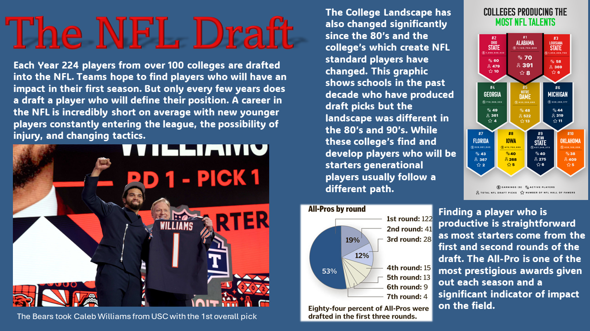

```{r setup, include=FALSE}
knitr::opts_chunk$set(echo = FALSE)

# Learn more about creating websites with Distill at:
# https://rstudio.github.io/distill/website.html

# Learn more about publishing to GitHub Pages at:
# https://rstudio.github.io/distill/publish_website.html#github-pages

```

## The Class

 Math 230: Data Visualization & Computing is a class for students to learn how to use `R`, a statistical
 coding language and how to properly create data visualizations with accessibility in mind. We learned design principles and basic statistical concepts throughout the semester to be able to create and share stories like what you will see below. 
 
 <br>
 
##  My Final Project

{}

I decided to look at the NFL draft to see how value differed throughout the round of the draft along with the occurrence of "generational" players. The full story is on the Final Project page where I breakdown the overall draft briefly then look at how often top tier players occur. 

<br>

## Sample Work From The Semester

The Past Work gallery of different visualizations which we created in class throughout the semester. We used a package called `aRtsy` to create different generative art but unfortunately it was significantly limited by the memory of my computer. My favorite is the Bucknell themed piece using the schools color which create a interesting kaleidoscope tie-dye-esque piece. 


